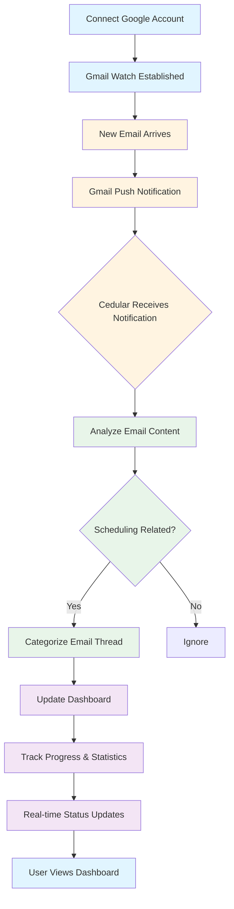

# Cedular

AI-assisted scheduling that keeps Gmail, meetings, and calendars in sync so you can spend less time chasing availability.

## Features

- 🔄 **Real-time Gmail Sync**: Automatically monitors your Gmail inbox for scheduling-related emails
- 🤖 **AI-Powered Analysis**: Intelligently interprets email content to understand scheduling intent
- 📅 **Calendar Integration**: Keeps your meetings and calendars synchronized
- 📊 **Dashboard & Tracking**: Real-time dashboard with email thread status and progress statistics
- 🔔 **Instant Notifications**: Immediate alerts when relevant scheduling emails arrive
- 🔐 **Secure Authentication**: Secure Google OAuth integration

## Tech Stack

- **Framework**: Next.js 16
- **Language**: TypeScript
- **Database**: PostgreSQL with Prisma ORM
- **Authentication**: Better Auth
- **AI**: OpenAI SDK
- **Styling**: Tailwind CSS
- **UI Components**: Radix UI
- **Package Manager**: pnpm

## Prerequisites

Before you begin, ensure you have the following installed:

- **Node.js** (v20 or higher)
- **pnpm** (v10 or higher)
- **Docker** and **Docker Compose** (for local PostgreSQL database)
- **Google Cloud Account** (for Gmail integration)

## How Cedular Works

Here's how Cedular automatically manages your scheduling emails:

**The Flow:**

When you connect your Google account, Cedular establishes a continuous connection with your Gmail inbox. As new emails arrive, Gmail instantly notifies Cedular through push notifications. Cedular then intelligently analyzes each email to detect scheduling-related content—whether it's a meeting request, availability inquiry, or calendar coordination.

Once identified, Cedular categorizes the email thread (pending, processing, or scheduled) and updates your dashboard in real-time. You can track the progress of each conversation, see statistics, and monitor how emails move through your scheduling workflow—all without manual intervention.



## Getting Started

### Installation

1. **Clone the repository** (if applicable) or navigate to the project directory

2. **Install dependencies**:

   ```bash
   pnpm install
   ```

   This automatically runs `prisma generate` postinstall.

3. **Set up environment variables**:

   ```bash
   cp .env.example .env.local
   ```

   Fill in the required values:

   - `DATABASE_URL` - PostgreSQL connection string
   - `NEXT_PUBLIC_APP_URL` - Your app URL (e.g., `http://localhost:3000`)
   - Google OAuth credentials (`GOOGLE_CLIENT_ID`, `GOOGLE_CLIENT_SECRET`)
   - Google OAuth redirect URIs
   - `GOOGLE_CLOUD_PROJECT_ID` (optional, for Gmail push notifications)
   - `GMAIL_PUBSUB_TOPIC` (optional, for Gmail push notifications)
   - `CRON_SECRET` (optional, for cron jobs)
   - Other optional integrations (OpenAI, Langfuse, etc.)

4. **Start the database**:

   ```bash
   pnpm db:start
   ```

   This starts a PostgreSQL instance using Docker Compose.

5. **Run database migrations**:

   ```bash
   pnpm db:migrate
   ```

   This applies all Prisma migrations and generates the Prisma client.

6. **Start the development server**:
   ```bash
   pnpm dev
   ```
   The app will be available at `http://localhost:3000`.

> **Note**: Restart the dev server after any `.env.local` changes.

## Gmail / Google Setup

Cedular requires Google Cloud setup for Gmail integration. Follow these steps:

1. **Complete the Google Cloud setup**:
   - Follow the full checklist in [`docs/setups/GOOGLE_SETUP.md`](docs/setups/GOOGLE_SETUP.md)
   - It covers:
     - Creating a Google Cloud project
     - Setting up OAuth credentials
     - Creating Pub/Sub topic and subscription
     - Configuring ngrok for local webhook testing
     - Understanding the Gmail watch/cron lifecycle
2. **Register Gmail watch**:
   - After signing in with Gmail, call `GET http://localhost:3000/api/gmail/setup` (or visit it in your browser)
   - This registers the Gmail watch for your account
   - **Important**: Gmail watches expire after ~7 days. You can either:
     - Manually call the setup endpoint again when it expires
     - Rely on the cron endpoint (`/api/cron/renew-gmail-watches`) protected by `CRON_SECRET`

- For local Pub/Sub pushes use ngrok (`ngrok http 3000`) and update the subscription’s push endpoint to `https://<forwarding-url>/api/emails/webhook`.
- Production deployments should point `NEXT_PUBLIC_APP_URL` and all Google redirect/webhook URLs to the live domain, secure secrets with your platform’s vault, and enable Pub/Sub authentication.

## Development scripts

- `pnpm dev` – Next.js dev server.
- `pnpm build` / `pnpm start` – production build and server.
- `pnpm lint` / `pnpm typecheck` – code quality checks.
- `pnpm db:*` – manage the PostgreSQL instance (`start`, `stop`, `reset`, `studio`, `migrate`, `generate`).
- `pnpm eval:*` – run Evalite commands for automated experiments (see `evalite.config.ts`).

## Troubleshooting

### Common Issues

- **Gmail watch expired**: Gmail watches expire after ~7 days. Call `/api/gmail/setup` again or set up the cron job for automatic renewal.
- **Webhook not receiving events**: Ensure ngrok is running and the Pub/Sub subscription push endpoint matches your ngrok URL.
- **Database connection errors**: Make sure Docker is running and the database container is up (`pnpm db:start`).

### Developer Notes

For developers working on the codebase:

- Email stats and cards share a grid/column layout (cards stretch in large layouts, tables span available width) and use shared skeleton states under `src/app/(internal)/meeting` and `.../email-threads`.
- The webhook handler (`src/app/api/emails/webhook/route.ts`) decodes Pub/Sub payloads, matches the assistant email, and kicks off `processEmailFromHistory`.
- Use `/api/cron/renew-gmail-watches` with the `Authorization: Bearer ${CRON_SECRET}` header for scheduled renewals; logs appear with `[Cron]` and `[Webhook]` prefixes.

## Additional references

- `.env.example` – all required environment variables for dev/local and optional integrations.
- `docs/setups/GOOGLE_SETUP.md` – canonical Google Cloud + Gmail flow (OAuth, Pub/Sub, ngrok, watches).
- `src/app/api/gmail/setup/route.ts`, `src/lib/gmail-watch-renewal.ts`, `src/app/api/emails/webhook/route.ts` – core server routes for Gmail integration.
