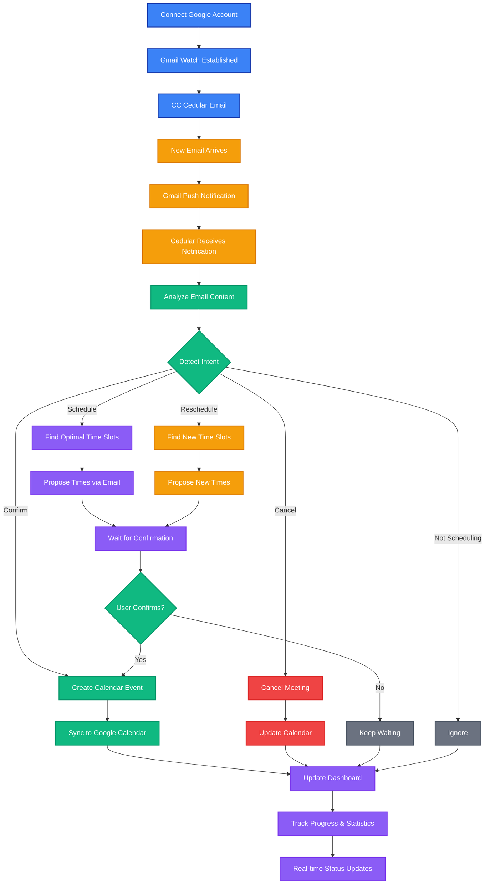

# Cedular


CC your scheduling emails to Cedular, and watch it handle everything automatically schedule, confirm, reschedule, and cancel meetings — all without leaving your email inbox.

## Features

- 📧 **CC-to-Schedule**: Simply CC your connected Cedular email address on any scheduling conversation—everything happens in your email inbox
- 📅 **Schedule Meetings**: Automatically finds optimal time slots and proposes them via email
- ✅ **Confirm Meetings**: When someone confirms a time, Cedular creates the calendar event automatically
- 🔄 **Reschedule Meetings**: Handles reschedule requests by finding new available slots
- ❌ **Cancel Meetings**: Cancels meetings and updates calendar events when requested
- 💬 **AI Chat Assistant**: Chat with Cedular directly to check availability, schedule meetings, and manage your calendar—all from the dashboard
- 🤖 **AI-Powered**: Intelligently interprets email content to understand scheduling intent (schedule, confirm, reschedule, cancel)
- ⚡ **Zero Manual Work**: Fully automated—no need to check emails or manually manage calendar events
- 📊 **Dashboard & Tracking**: Monitor email threads and meeting status in real-time
- 🔐 **Secure**: Secure Google OAuth integration with your Gmail account

## Tech Stack

- **Framework**: Next.js 16
- **Language**: TypeScript
- **Database**: PostgreSQL with Prisma ORM
- **Authentication**: Better Auth
- **AI**: OpenAI SDK, Workflow Dev Kit
- **Styling**: Tailwind CSS
- **UI Components**: Radix UI
- **Package Manager**: pnpm

## Prerequisites

Before you begin, ensure you have the following installed:

- **Node.js** (v20 or higher)
- **pnpm** (v10 or higher)
- **Docker** and **Docker Compose** (for local PostgreSQL database)
- **Google Cloud Account** (for Gmail integration)

## How Cedular Works

Here's how Cedular works—it's as simple as CC'ing an email:

**The Flow:**

Connect your Google account to get your dedicated Cedular email address. When you need to handle scheduling, just **CC your Cedular email** on any scheduling conversation. As soon as the email arrives, Gmail instantly notifies Cedular through push notifications.

Cedular intelligently analyzes the email content to understand what action is needed:

- **Schedule**: Finds optimal time slots based on your calendar and preferences, proposes them via email, and waits for confirmation
- **Confirm**: When someone confirms a proposed time, automatically creates the calendar event and syncs it to Google Calendar
- **Reschedule**: Finds new available slots and proposes alternative times
- **Cancel**: Cancels the meeting and updates your calendar automatically

All of this happens automatically **without leaving your email inbox**—Cedular handles the entire email conversation, manages your calendar, and keeps your dashboard updated. You can track progress and see statistics, but you never have to lift a finger. The entire scheduling workflow happens through email replies, so you can stay in your inbox where you already work.



## AI Chat Assistant

Beyond email-based scheduling, Cedular also includes an **AI chat assistant** built into the dashboard. Chat directly with Cedular to:

- **Check your calendar availability** - Ask "What's on my calendar this week?"
- **Schedule meetings** - Say "Schedule a meeting with john@example.com next Tuesday at 2pm"
- **Find optimal times** - Request "Find a good time for a 1-hour meeting with the team"
- **Manage events** - Update or cancel meetings through conversation
- **Get calendar insights** - Ask questions about your schedule

The chat assistant uses the same calendar tools and AI capabilities as the email workflow, giving you a conversational interface for managing your calendar when you prefer typing over email.

## Getting Started

### Installation

1. **Clone the repository** (if applicable) or navigate to the project directory

2. **Install dependencies**:

   ```bash
   pnpm install
   ```

   This automatically runs `prisma generate` postinstall.

3. **Set up environment variables**:

   ```bash
   cp .env.example .env.local
   ```

   Fill in the required values:

   - `DATABASE_URL` - PostgreSQL connection string
   - `NEXT_PUBLIC_APP_URL` - Your app URL (e.g., `http://localhost:3000`)
   - Google OAuth credentials (`GOOGLE_CLIENT_ID`, `GOOGLE_CLIENT_SECRET`)
   - Google OAuth redirect URIs
   - `GOOGLE_CLOUD_PROJECT_ID` (optional, for Gmail push notifications)
   - `GMAIL_PUBSUB_TOPIC` (optional, for Gmail push notifications)
   - `CRON_SECRET` (optional, for cron jobs)
   - Other optional integrations (OpenAI, Langfuse, etc.)

4. **Start the database**:

   ```bash
   pnpm db:start
   ```

   This starts a PostgreSQL instance using Docker Compose.

5. **Run database migrations**:

   ```bash
   pnpm db:migrate
   ```

   This applies all Prisma migrations and generates the Prisma client.

6. **Start the development server**:
   ```bash
   pnpm dev
   ```
   The app will be available at `http://localhost:3000`.

> **Note**: Restart the dev server after any `.env.local` changes.

## Gmail / Google Setup

Cedular requires Google Cloud setup for Gmail integration. Follow these steps:

1. **Complete the Google Cloud setup**:
   - Follow the full checklist in [`docs/setups/GOOGLE_SETUP.md`](docs/setups/GOOGLE_SETUP.md)
   - It covers:
     - Creating a Google Cloud project
     - Setting up OAuth credentials
     - Creating Pub/Sub topic and subscription
     - Configuring ngrok for local webhook testing
     - Understanding the Gmail watch/cron lifecycle
2. **Register Gmail watch**:
   - After signing in with Gmail, call `GET http://localhost:3000/api/gmail/setup` (or visit it in your browser)
   - This registers the Gmail watch for your account
   - **Important**: Gmail watches expire after ~7 days. You can either:
     - Manually call the setup endpoint again when it expires
     - Rely on the cron endpoint (`/api/cron/renew-gmail-watches`) protected by `CRON_SECRET`

- For local Pub/Sub pushes use ngrok (`ngrok http 3000`) and update the subscription’s push endpoint to `https://<forwarding-url>/api/emails/webhook`.
- Production deployments should point `NEXT_PUBLIC_APP_URL` and all Google redirect/webhook URLs to the live domain, secure secrets with your platform’s vault, and enable Pub/Sub authentication.

## Development scripts

- `pnpm dev` – Next.js dev server.
- `pnpm build` / `pnpm start` – production build and server.
- `pnpm lint` / `pnpm typecheck` – code quality checks.
- `pnpm db:*` – manage the PostgreSQL instance (`start`, `stop`, `reset`, `studio`, `migrate`, `generate`).
- `pnpm eval:*` – run Evalite commands for automated experiments (see `evalite.config.ts`).

## Production Deployment

### Database Migrations

If you're using **Prisma Accelerate** with PostgreSQL (connection string starts with `prisma+postgres://accelerate.prisma-data.net/`), migrations work directly with the Accelerate connection string.

**Good news**: According to [Prisma Accelerate documentation](https://www.prisma.io/docs/accelerate/getting-started), PostgreSQL users don't need a separate direct connection string—Prisma Migrate and Introspection work directly with `prisma+postgres://` URLs.

#### Steps to migrate production database:

1. **Ensure your `DATABASE_URL` is set** in your production environment:

   ```
   DATABASE_URL="prisma+postgres://accelerate.prisma-data.net/?api_key=..."
   ```

2. **Run production migrations**:

   ```bash
   pnpm db:migrate:deploy
   ```

3. **Verify migrations**:
   ```bash
   pnpm db:migrate:status
   ```

**Note**:

- Use `prisma migrate deploy` (not `migrate dev`) for production - it applies pending migrations without creating new ones
- For PostgreSQL, the `prisma+postgres://` connection string works for both queries and migrations
- If you're using other databases (MySQL, MongoDB, etc.) with `prisma://` URLs, you may need a `DIRECT_DATABASE_URL` for migrations

### Environment Variables

Make sure all production environment variables are set in your hosting platform (Vercel, etc.):

- `DATABASE_URL` - Prisma Accelerate connection string (for app queries)
- `DIRECT_DATABASE_URL` - Direct PostgreSQL connection string (for migrations only)
- All Google OAuth credentials
- `NEXT_PUBLIC_APP_URL` - Your production domain
- Other required variables from `.env.example`

## Troubleshooting

### Common Issues

- **Gmail watch expired**: Gmail watches expire after ~7 days. Call `/api/gmail/setup` again or set up the cron job for automatic renewal.
- **Webhook not receiving events**: Ensure ngrok is running and the Pub/Sub subscription push endpoint matches your ngrok URL.
- **Database connection errors**: Make sure Docker is running and the database container is up (`pnpm db:start`).

### Developer Notes

For developers working on the codebase:

- Email stats and cards share a grid/column layout (cards stretch in large layouts, tables span available width) and use shared skeleton states under `src/app/(internal)/meeting` and `.../email-threads`.
- The webhook handler (`src/app/api/emails/webhook/route.ts`) decodes Pub/Sub payloads, matches the assistant email, and kicks off `processEmailFromHistory`.
- Use `/api/cron/renew-gmail-watches` with the `Authorization: Bearer ${CRON_SECRET}` header for scheduled renewals; logs appear with `[Cron]` and `[Webhook]` prefixes.

## Additional references

- `.env.example` – all required environment variables for dev/local and optional integrations.
- `docs/setups/GOOGLE_SETUP.md` – canonical Google Cloud + Gmail flow (OAuth, Pub/Sub, ngrok, watches).
- `src/app/api/gmail/setup/route.ts`, `src/lib/gmail-watch-renewal.ts`, `src/app/api/emails/webhook/route.ts` – core server routes for Gmail integration.
